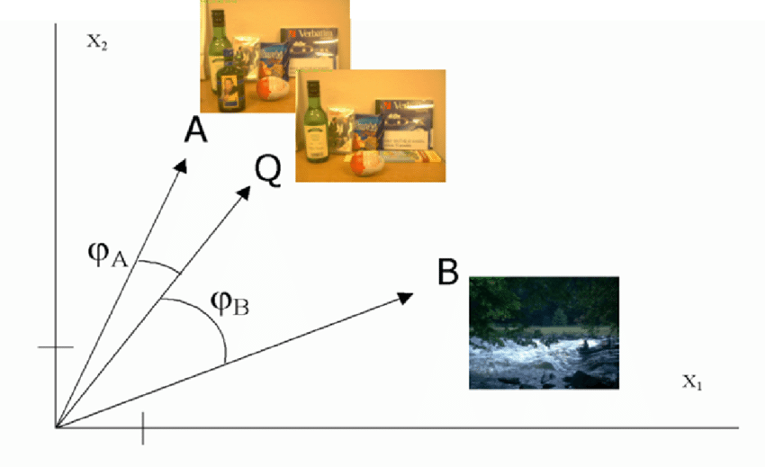
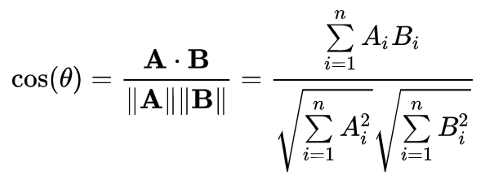
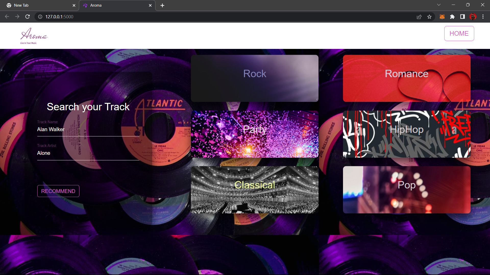
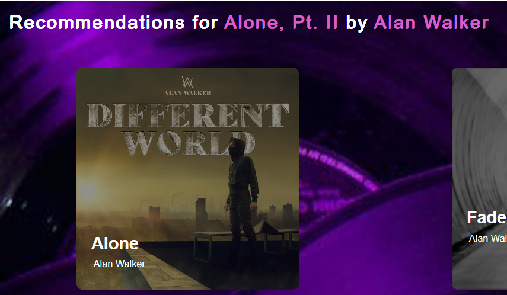
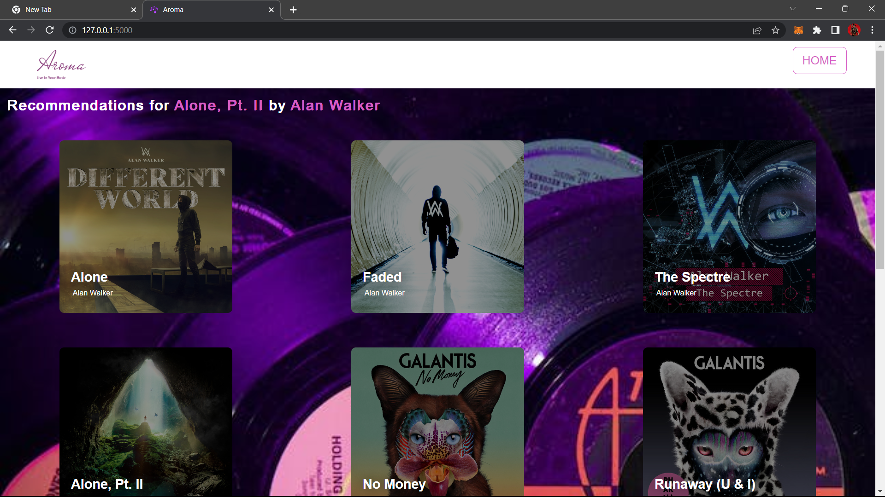

# Music Recommendation System

------------------------------

### Visit the [website](https://music-recommendation-alucard.herokuapp.com/)

### Table of Contents:
#### About the project

    1. Content Based Filtering
    2. Advantages
    3. Cosine Similarity
#### Getting Started
    1. Prerequisites
    2. Installation
#### Usage

----------------------
### About the project

This is a web application that suggests 10 songs similar 
to the song chosen by the user. The recommendations
are generated from around 6000 songs available
in the dataset.

* #### Content Based Filtering
    Content based filtering uses item features to 
    recommend other items similar to what the user likes,
    based on their previous actions or explicit
    feedback.

* #### Why use content based filtering
    The model doesn't need any data about other users, since
    the recommendations are specific to this user.
    This makes it easier to scale to large number of 
    users. Recommendations are also highly relevant 
    to the user.

* #### Cosine Similarity
  Cosine similarity measures the similarity between 
  two vectors by calculating the cosine of the angle 
  between them. A simple visualization and the 
  formula can be found below.

  

  

* #### Built with
    `Python HTML CSS JavaScript`

------------------------
### Getting Started

* #### Prerequisites
  * Python 3.10 or higher
  * Flask
  
* #### Installation  
   To get a local copy up and running follow 
these simple example steps.

  1. Clone the repo

     `git clone https://github.com/singharsh10/Music_Recommendation_System.git`
  2. Creating virtual environment
      
     `pip install virtualenv`
  
      `virtualenv my_name`
  4. Install requirements
    
     `pip install -r requirements.txt`
  5. Enter the spotify client_id and client_secret in .env file.
     If you don't have one, follow [this](https://cran.r-project.org/web/packages/spotidy/vignettes/Connecting-with-the-Spotify-API.html).
  6. Start Flask server
    
     `python app.py`
  
-----------------------
### Usage

Enter name of the song and song artist. Make sure you entered the
details correctly.

**Note:** Do not use comma to separate various artist names enter them without
 using comma and if there are various artist enter them in the 
order given on spotify as the API won't be able to find the song if 
you enter it a different order. An example has been shown below

Fill the track artist field like this
`Nicky Romero Krewella`

After this press the recommend button.

To listen to these songs just click on them and you will be 
redirected to spotify web player.
 
For more details refer the PPT in the repo.
